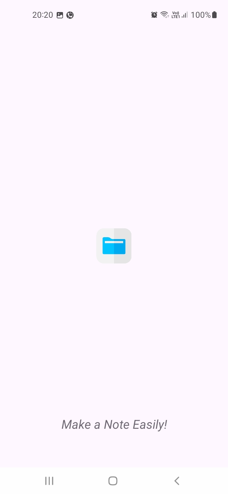
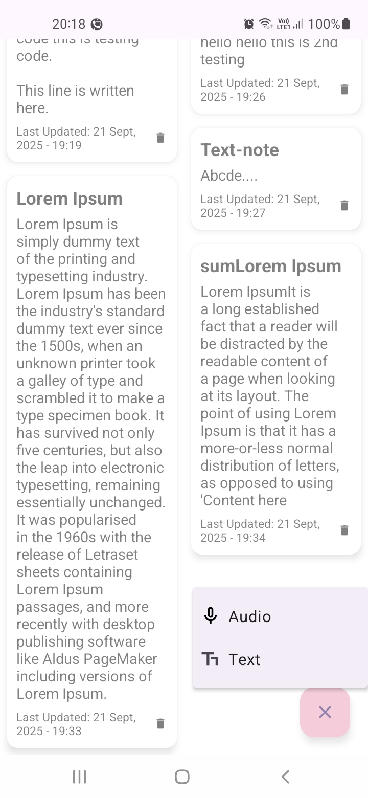
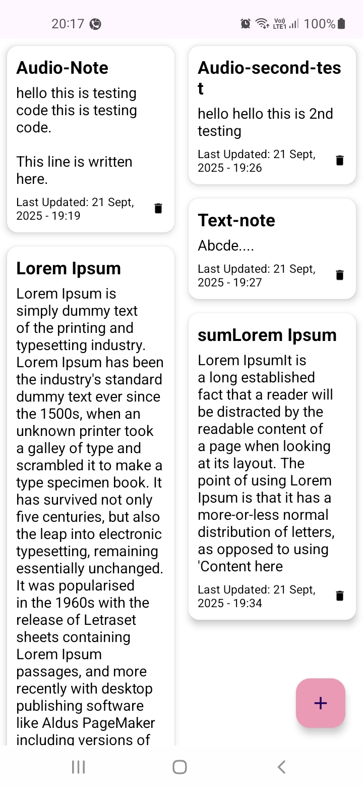
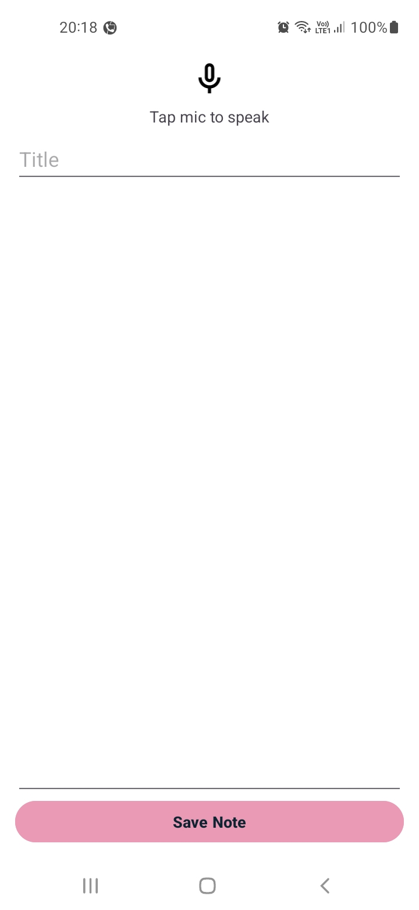
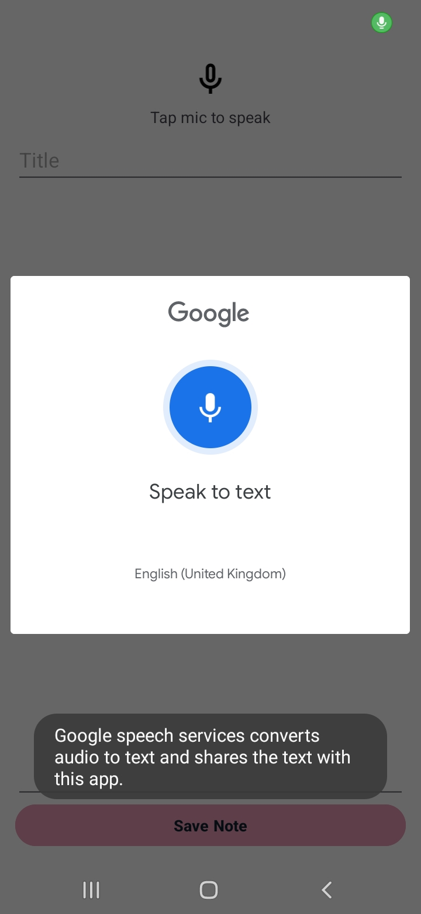
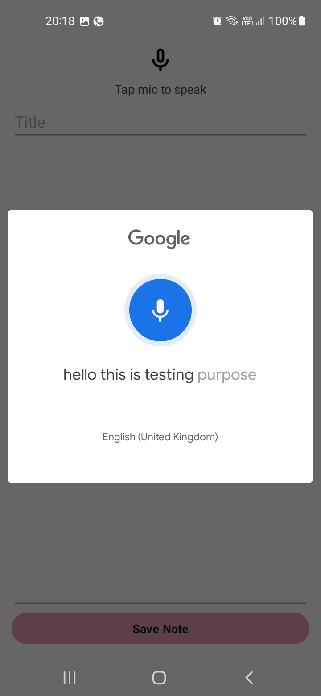
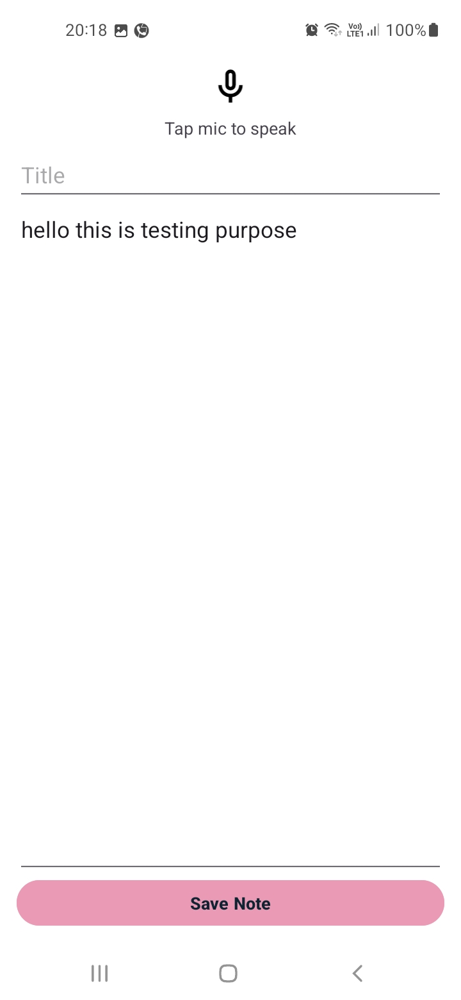
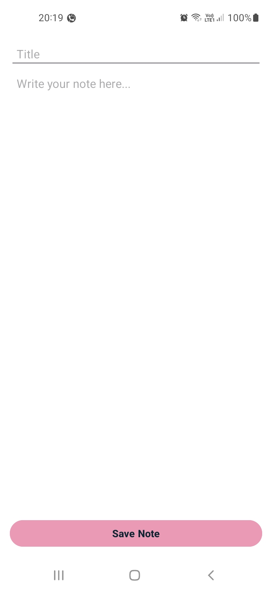

# Android Note App

Native Notes application built with **Kotlin** and **MVVM architecture**.  
Users can create, edit, and delete notes in multiple formats: **Text, Audio**. 
The app uses a **RecyclerView with CardView** layout for an attractive and responsive UI.

## Screenshots

### Splash Screen

### Pop-up Menu for Adding Notes

### Main Notes List

### Add Audio Note

### Audio Mic Feature

### Sample audio note

### Audio to text conversion

### Add Text Note

## Features

- Add notes in two formats:
    - Text
    - Audio (Speech-to-Text)
   
[//]: # (- Edit existing notes)
- Delete notes
- Modern, professional UI with CardView
- MVVM architecture using LiveData and ViewModel
- Room database for offline storage

---

## Tech Stack

- **Language:** Kotlin
- **Architecture:** MVVM
- **Database:** Room
- **UI Components:** RecyclerView, CardView, Material Design
- **Other Libraries:** ViewModel, LiveData

---

## ⬇ Download

Download and try the app:

- 📦 From GitHub **Releases page** 
- 👉 [**Download here**](https://github.com/Angkitadutta/NoteApp.git)

***
> Feel free to star ⭐ this repository, if you like it
